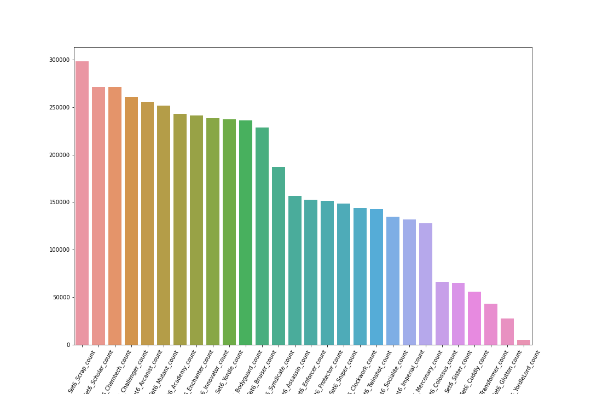

# Teamfight Tactics Matchmaking Using XGBRanker

Our goal is to use ranking algorithms to predict the top 4 players of
any Teamfight Tactics (TFT) lobby.

By consistently being able to identify the top half of any lobby,
we can use this to try and create better Double Up lobbies, where
the teams are balanced for competitive gameplay and hopefully resulting
in tangible benefits such as larger playerbase or intangible one such as
player goodwill.

## Background

Created by Riot Games, TFT is an auto battler that was based released
in 2019 in response to the auto battler boom. Players are put into
lobbies with 7 other players and fight each other in a round robbing
fashion, building stronger teams with units and the traits the units 
come with to have synergistic effects and eventually eliminate the other
players to be the last one standing.
## Problem Statement

How good of a model can we create to differentiate between posts from 

- r/MovieDetails
- r/ShittyMovieDetails

In the interest of understanding ironic and sarcastic speech intended to imitate 
more genuine content. This is the first step in a longer process and should be understood as such.

When done succesfully, this can be used by companies to better understand online sentiments,
many of which are buried under layers of irony, especially in today's online culture.

We will be optimizing for accuracy as there is no substantial difference between a 
type I or type II error in this case.

## Data Dictionary

All data values can be found at [Riot's Developer API Documentation](https://developer.riotgames.com/apis)

## Assumptions

We have a number of assumptions for this analysis. These assumptions 
can and will be addressed in the conclusion section of the readme.

1. Players play similarly in standard TFT matches as Double Up without
a significant difference in playstyle or performance.

2. Matching players who are expected to place in the Top 4 with non
Top 4 players will result in closer matches that result in better player
experience

3. There are no significant differences in playstyle between elos as most
of the matches will presumably Goldish elo due to match making and data 
acquisition methods 

4. A players performance doesn't flucuate significantly and their previous games can be used as an indicator for future performance.

##  Analysis Summary

At initial glance, most conversations about the meta revolving around enchanters
doesn't seem to hold true with Scrap, Scholar, and Chemtech being in the top three while
Enchanters are only 8th in terms of number of trait counts.

Scraps seem to hold 1st place relatively well, presumably because there are a decent
amount of scrap units at early tiers that allow them to be played for an opener.

 

After breaking the traits down by tier count however, tiers being certain numbers of units
where traits give synergistic effects to the entire team, something much closer to what most people
see as the meta appears. 

This is likely due to many of the meta dominant units being restricted to higher tiers, therefore
by unit count alone, they will often be played less, despite their strength.

### Model Analysis 

Our model received an NCDG score of 

Train: 0.9889

Test: 0.9884

Noticeably larger than our null model where we predicted 
[1,2,3,4,5,6,7,8] by for each set. Resulting in an average of 

All: 0.8405

With a NDCG this high, I believe it is possible to push into production with 
a to match Top 4 players with non Top 4 Players.

We also have the above tree to explain how the model determines a player's 
relevancy score. 

We also have a feature importances that show that data such as damage delt
and gold are far more significant than composition or units. A model with 
only board composition might be worthwhile as well. 

## Conclusion

In conclusion, our model for predicting the placement of players in a TFT
lobby is performing well enough to be used for the start of a Double Up match
making algorithm.

Some steps moving foward to take in order would include:

1. Incorporating more Data. 

Some fields such as unit items were left out due to difficulties 
interpreting them into our dataset. This could be potentially increase 
our performance even further.

More importantly however, I would hope to get more data throughout
the game state. With the data provided we only have an endgame snapshot
that loses the nuances of decisions made in early, mid, or late game states
which are critical to TFT. 

More data that would also be critical would be to seed even more players
in different ranks during the data acquisition stage and checking our assumption
that there is no difference in playstyles between ranks. 

2. Attach Rankings to Player 

By attaching recent rankings to a player we may be able to mimic something
similar to an match making rating. This would allow us to predict beforehand
who should be matched with who as opposed to retrospectively which is infinetly
more useful. 
## Acknowledgements

 - [Ritvik Math](https://www.youtube.com/channel/UCUcpVoi5KkJmnE3bvEhHR0Q)
 - [Sophie Watson](https://github.com/sophwats) 

 
 
